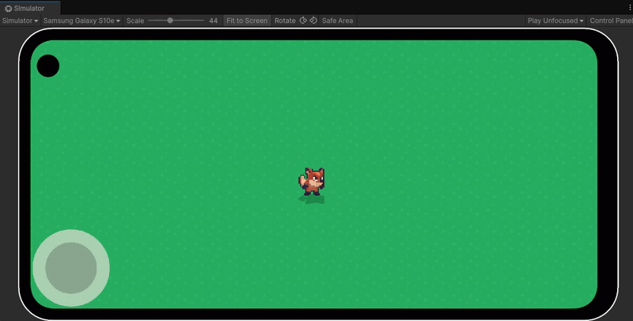

# VirtualJoystick.Unity
- 유니티를 이용한 가상 조이스틱 만들기 연습 프로젝트입니다.

## 유니티 엔진 버전
- `6000.0.40f1`

## 목표
- 유니티를 활용한 가상 조이스틱 구현
- 기존 참고 자료 기반의 기능 분석 및 개선 사항 적용

## 개선 사항

### 모바일 대응 가상 조이스틱 구현
- 모바일 터치 환경에서도 부드럽게 동작하도록 가상 조이스틱을 구현

### 코드 구조 정리 및 불필요한 로직 제거
- 참고 자료의 불필요하거나 혼란을 줄 수 있는 코드 구조를 정리하고 개선
- 터치 입력 좌표 구분
  - 기존: 터치 포지션을 정규화된 좌표로만 처리하여 위치인지, 벡터인지 혼동을 줄 수 있는 구조
  - 변경: 실제 터치 좌표(touchPosition)와 정규화된 방향 벡터(touchAxis)를 별도로 분리하여 처리 로직 명확화
- 이벤트 처리 방식 개선
  - 기존: `OnPointerDown`/`OnDrag`/`OnPointerUp` 사용
  - 변경: Unity의 드래그 인터페이스에 맞는 `OnBeginDrag`/`OnDrag`/`OnEndDrag` 구조로 재구성하여 이벤트 흐름 일관성 확보

### 가상 조이스틱 입력 기반 스프라이트 애니메이션 추가
- 캐릭터 방향 전환 및 이동 애니메이션을 조이스틱 입력에 따라 자동 재생되도록 구현
- 입력에 따라 애니메이션이 자연스럽게 전환

### 화면 경계 제한 기능 추가
- 플레이어가 화면 바깥으로 나가는 문제를 방지하기 위해 경계 영역을 설정
- 화면 해상도에 따라 자동 조정되며, 카메라 이동 없이도 캐릭터가 보이도록 함

### 입체감을 위한 그림자 효과 추가
- 플레이어 캐릭터 아래에 반투명 그림자를 추가하여 입체감 강조
- 애니메이션이나 조명 효과 없이도 시각적 깊이 부여

## 구현 결과

## 참고 자료
- [[Unity Basic Skills] 03. 모바일용 가상 컨트롤 (Virtual Joystick)](https://www.youtube.com/watch?v=yWRdnmLHHb8&t=144s)
- [[Unity 2D Basic] 05-01. 2D Sprite / Animation](https://www.youtube.com/watch?v=jg4nCHgDCFg&t=2s)
- [[Unity 2D Basic] 05-02. 2D Animation 실습](https://www.youtube.com/watch?v=rQMbDQ1yTAo])
